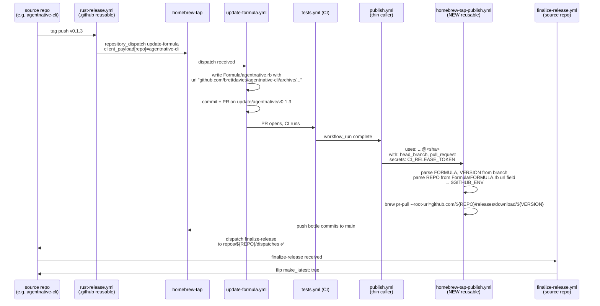

# fix: Promote homebrew-tap publish pipeline into reusable workflow

## Overview

Promote the Homebrew tap's `publish.yml` pipeline into `brettdavies/.github` as a reusable `workflow_call`
(`homebrew-tap-publish.yml`), and fix the latent silent wrong-repo dispatch bug as part of the promotion. The tap's
`publish.yml` shrinks to a thin caller that passes `head_branch` and (optionally) `pull_request` to the reusable
workflow; every piece of the source-repo slug flows through the formula file itself rather than through a lossy two-hop
dispatch chain.

The fix closes todo
[006-planned-p1-homebrew-tap-finalize-dispatch-wrong-repo.md](../../.context/compound-engineering/todos/006-planned-p1-homebrew-tap-finalize-dispatch-wrong-repo.md).
Scope spans two repos: **`brettdavies/.github`** (new reusable workflow + README) and **`brettdavies/homebrew-tap`**
(caller shim + potential ruleset/CODEOWNERS renames).

## Status Updates

### 2026-04-22 — v0.1.3 shipped, bug recurred, Stage B validation target resets to v0.1.4

The plan's original Stage B validation named `agentnative-cli` v0.1.3 as the forcing function — ship v0.1.3 naturally,
observe `finalize-release` firing automatically, confirm `/releases/latest` flips without manual `gh api` recovery.

**Reality diverged.** v0.1.3 shipped on 2026-04-22 with this fix still not landed (Phase 1 and Phase 2 work has not
started). The bug recurred verbatim: tap's `Publish bottles → Finalize source repo release` exited 0, no
`finalize-release` run appeared on `agentnative-cli`, `/releases/latest` stayed on v0.1.2. Manually dispatched
`finalize-release` from the correct slug; run `24810875612` flipped `make_latest: true` cleanly. v0.1.3 is now the
latest release, but the first Stage B validation opportunity has been consumed.

**Plan adjustments:**

- Stage B validation target resets to **v0.1.4** (or whichever `agentnative-cli` release ships after Phase 2 merges).
  Every `v0.1.3` reference in the Phased Delivery, Rollout, and Validation sections below should be read as "the next
  organic release after Phase 2 ships."
- Stage A (smoke test via `workflow_dispatch`) is unaffected — still the correct gate, still independent of release
  cadence.
- Risk delta: the manual-recovery workaround is now the de facto second step of every release. Safe but forgettable.
  Increases the soft urgency on Phase 1 / Phase 2 land without changing the plan shape.
- New learning surfaced by the recurrence: **alias-shadow silence** — when a previously-renamed repo's alias is
  reclaimed by an unrelated repo, dispatches to the old slug silently land on the new occupant. Documented in
  `docs/solutions/best-practices/github-repo-rename-release-pipeline-resilience-2026-04-20.md` as Bug 7 and propagated
  to the architecture and dispatch docs (commits `c38388b` + `4c08830` in `brettdavies/solutions-docs@main`).
- Acceptance criteria on todo 006 expanded with a **Squash-the-class audit** section: org-wide grep for
  dispatch-targets-by-name, rename-reclaim preflight, post-dispatch assertion guard, and inline cross-references to the
  rename-resilience doc.

## Problem Frame

### The bug

`brettdavies/homebrew-tap/.github/workflows/publish.yml:98-105` fires the `finalize-release` `repository_dispatch` to
`repos/brettdavies/${FORMULA}/dispatches`, where `FORMULA` is the Homebrew Ruby class name. This only works when the
formula name happens to equal the GitHub source-repo slug. For `agentnative` (class) → `agentnative-cli` (source repo),
the dispatch lands on `brettdavies/agentnative` — a real but unrelated spec repo that accepts the 2xx with zero side
effect. The publish workflow reports green, nothing finalizes, and `/releases/latest` stays stuck on the previous tag.
Discovered during v0.1.2 release of `agentnative-cli` on 2026-04-21.

### Why a reusable workflow is the right fix, not just a one-line slug fix

Three options were weighed (see origin todo, lines 138–226):

1. **Option 1 — in-place sed fix** in the tap's `publish.yml` at the dispatch step. One-hunk diff, minimal risk,
   convention-consistent with the existing `brew pr-pull --root-url` parse 14 lines earlier. But leaves publish logic
   ad-hoc in the tap; future formulae with mismatched names could silently reintroduce the class of bug.
2. **Option 2 — thread `source_repo` through the dispatch chain** via a stash mechanism because `workflow_run` drops
   `client_payload`. More code than Option 1 for no correctness benefit.
3. **Option 3 — promote publish.yml into `brettdavies/.github` as reusable** (this plan). Centralizes logic across all
   tap formulae, SHA-pinnable by callers, matches the existing `rust-*.yml` family. Correct architecture even if the
   current consumer count is small.

User directive: *"I don't care about speed of unblocking. Always choose the best solution."* → Option 3.

### Design pivot from conversation-level sketch

Initial conversation sketch *considered* switching the tap's internal handoff from `workflow_run` (which drops
`client_payload`) to `gh workflow run publish.yml` (which preserves typed inputs), so `source_repo` could flow as a
typed caller input. **Research surfaced a cleaner design, and that trigger-topology change was rejected:** the formula
file itself (`Formula/${FORMULA}.rb`) already contains the authoritative `url
"https://github.com/<owner>/<repo>/archive/..."` field, written by `update-formula.yml` from `client_payload[repo]`.
Reading it back inside the reusable workflow is structurally identical to threading `source_repo` as a typed input but
strictly simpler: **the tap's `workflow_run` trigger stays unchanged**, no `update-formula.yml` changes, no new handoff
mechanism. The formula file IS the durable record. *Tradeoff surfaced by document-review:* this design shifts the
failure mode from "formula-name/repo-slug drift" to "formula-file parsing vs. Homebrew DSL evolution." The `head -n1`
sed picks the first plausible URL match; a future `head "..."` line or edited `url` field could silently redirect the
dispatch. See `Q2 — REPO allowlist` in the document-review decision packet.

This matches the rename-resilience solution doc's prescription to derive slugs at use time rather than bake them into
caller state (`docs/solutions/best-practices/github-repo-rename-release-pipeline-resilience-2026-04-20.md`).

## Requirements Trace

- **R1.** The `finalize-release` dispatch must land on the correct source repo when `formula name != repo slug` (current
  failing case: `agentnative` → `agentnative-cli`).
- **R2.** The publish pipeline logic must live in `brettdavies/.github` as a reusable `workflow_call`, mirroring the
  conventions of `rust-release.yml` and `rust-finalize-release.yml`.
- **R3.** The tap's `publish.yml` must remain triggerable by `workflow_run` (CI completion) and `workflow_dispatch`
  (manual reruns); both paths must continue to work after the caller collapse.
- **R4.** The fix must work for all three current tap consumers (`xurl-rs`, `bird`, `agentnative`) on their next release
  — including the two where formula name coincidentally equals repo slug, verifying no regression.
- **R5.** SHA-pinning rules for external actions must be upheld, with explicit documentation for any
  `Homebrew/actions/*` exceptions.
- **R6.** No regression in observable behavior: bottles still upload to the source repo's GitHub Release, formula PRs
  still merge, `make_latest: true` still flips at the end of the chain.
- **R7.** Rollout must not leave required status-check contexts in a BLOCKED-but-green state when inline job names shift
  to reusable-caller-qualified names.

## Scope Boundaries

- **No changes** to `.github/workflows/rust-release.yml` — its existing dispatch to the tap already carries the
  authoritative `client_payload[repo]` value; no inputs need to change.
- **No changes** to `homebrew-tap/.github/workflows/update-formula.yml` — it already writes `Formula/${FORMULA}.rb` with
  the correct `url` field using `client_payload[repo]`.
- **No changes** to `homebrew-tap/.github/workflows/tests.yml` — its `--root-url` derivation is already correct.
- **No changes** to source repos' `finalize-release.yml` shims or `rust-finalize-release.yml`.
- **No post-dispatch verification/polling** of the finalize-release run. The fix correctly routes to the right repo;
  defensive observability for the wider silent-failure class is deferred.

### Deferred to Separate Tasks

- **Skill updates** in `~/.claude/skills/homebrew-tap-publish/` (SKILL.md step 3 and
  `templates/homebrew-dispatch-job.yml` both hardcode `brettdavies/<crate-name>` in documentation examples): deferred to
  a follow-up skill-author pass. Not blocking — the skill is user-local instruction, not runtime code.
- **Cross-repo SHA alignment** via `pin-actions.sh --align brettdavies/.github brettdavies/homebrew-tap` for
  `actions/github-script` (v8.0.0 here vs v9.0.0 in tap) and `actions/upload-artifact` (v7.0.0 vs v7.0.1): deferred to a
  chore PR. Incidental to this fix.
- **Post-dispatch observability** (polling for the finalize-release run on the target repo with timeout): deferred to a
  future todo if the silent-failure class recurs for a different reason.

## Context & Research

### Relevant code and patterns

- `/home/brett/dev/dot-github/.github/workflows/rust-release.yml` — canonical reusable-workflow shape; input
  declarations (lines 19–32), explicit secret block (not `secrets: inherit`), per-job permission narrowing (lines 91–92,
  203–205, 227–228), `GH_TOKEN: ${{ secrets.CI_RELEASE_TOKEN }}` pattern (line 284), `concurrency` with
  `cancel-in-progress: false`, env-wide `FORCE_JAVASCRIPT_ACTIONS_TO_NODE24: true`.
- `/home/brett/dev/dot-github/.github/workflows/rust-finalize-release.yml` — security-invariant header comment (lines
  17–19), regex input validation (lines 42–45), receiving-side pattern for `repository_dispatch` events.
- `/home/brett/dev/homebrew-tap/.github/workflows/publish.yml` — **source of the logic being lifted.** The good `REPO`
  parse lives at lines 73–91 for `--root-url`; the bug lives at lines 98–105 for the dispatch.
- `/home/brett/dev/dot-github/README.md` lines 196–200 — stale "Naming coupling" callout that must be rewritten: the new
  workflow *is* the resolution of the coupling.
- `/home/brett/dev/dot-github/README.md` lines 30–152 — documentation shape per workflow (two-column table of Trigger /
  Inputs / Secrets / Required caller permissions, followed by YAML caller example).

### Institutional learnings

- `docs/solutions/architecture-patterns/release-pipeline-reusable-workflows-20260320.md` — canonical three-repo pipeline
  shape. Lifecycle diagram at lines 69–129; PAT scope at lines 335–339.
- `docs/solutions/best-practices/github-repo-rename-release-pipeline-resilience-2026-04-20.md` — **derive slugs at use
  time, don't bake into caller state.** Recipe 2 (lines 74–84) is the exact sed pattern to mirror.
- `docs/solutions/integration-issues/github-status-check-context-inline-vs-reusable-2026-04-14.md` — #1 rollout
  landmine: inline job names become `<caller-job-id> / <reusable-job-id>`. Required for R7.
- `docs/solutions/workflow-issues/cherry-pick-standalone-to-reusable-workflow-transition-20260413.md` — prior incident
  converting a standalone workflow to a reusable caller; status-check rename hazards and sequencing.
- `docs/solutions/integration-issues/homebrew-tap-automated-formula-updates-via-dispatch.md` — must-preserve hardenings
  for `repository_dispatch` receivers (expression injection, `setup-homebrew` checkout destruction, curl `--fail` vs
  `--fail-with-body`). Lines 222–257.
- `docs/solutions/architecture-patterns/homebrew-all-bottle-publishing-pipeline-architecture-2026-04-20.md` — full
  3-repo dance failure-mode map; required reading before refactoring any node.
- `docs/solutions/architecture-patterns/github-pat-consolidation-across-repos-20260319.md` — explicit secret blocks,
  never `secrets: inherit`; renaming a reusable workflow's secret is a breaking change for all callers.
- `docs/solutions/best-practices/ci-hardening-defaults-permissions-read-failfast-false-2026-04-20.md` — top-level
  `permissions: contents: read` with per-job escalation.

### External references

- GitHub Actions reusable workflow docs: `workflow_call` secrets inheritance model (used to confirm explicit `secrets:`
  block is correct for cross-repo same-owner calls).
- Homebrew Actions family (`Homebrew/actions/setup-homebrew`, `git-user-config`, `git-try-push`): floating `@main` refs
  in both existing tap workflows; decision point in this plan whether to pin.

## Key Technical Decisions

- **Derive source-repo slug inside the reusable workflow from `Formula/${FORMULA}.rb`, not as a typed input.**
  *Rationale:* rename-resilience (formula file is the authoritative record, written by `update-formula.yml` from
  `client_payload[repo]`); avoids caching stale data across hops; mirrors already-shipped `--root-url` pattern in
  current `publish.yml:73-91` and `tests.yml:152-183`; eliminates need to change `update-formula.yml` or switch the
  tap's trigger from `workflow_run` to `workflow_dispatch`. This is a design pivot from the conversation-level sketch —
  the formula file transports the data rather than the dispatch chain.

- **Parse `FORMULA`, `VERSION`, `PULL_REQUEST`, `REPO` once at the top of the reusable job and export to
  `$GITHUB_ENV`.** *Rationale:* satisfies todo 006's acceptance criterion line 287 ("sed parse / `REPO` export is
  hoisted into a shared step"); every downstream step reads from env; no duplicated regex across steps; fail-loud at one
  chokepoint.

- **Minimal reusable-workflow inputs: `head_branch` (required), `pull_request` (optional, default `''`).** *Rationale:*
  caller provides only what it has — from `workflow_run.head_branch` (auto path) or `workflow_dispatch` inputs (manual
  path). Formula name, version, PR number, and source-repo slug are all derivable inside the reusable. Smaller contract
  surface = fewer breaking-change opportunities for callers.

- **Explicit secret declaration, never `secrets: inherit`.** *Rationale:* repo convention (README:174); makes secret
  renames detectable at `actionlint` time; consistent with `rust-release.yml:7-13` pattern. The reusable declares
  `CI_RELEASE_TOKEN` as required; the tap's caller passes it via `secrets: { CI_RELEASE_TOKEN: ... }`.

- **Pin `Homebrew/actions/*` to explicit SHAs in the new workflow.** *Rationale:* supply-chain rule is hard. The current
  `@main` pins in the tap are existing debt, not a precedent. Resolve current SHAs at PR time via `gh api
  repos/Homebrew/actions/commits/main --jq .sha` and record version in trailing comment. Pre-existing `@main` pins in
  tap's `update-formula.yml` and `tests.yml` are out of scope (chore PR).

- **Keep the tap's `workflow_run` trigger.** *Rationale:* no need to change the trigger topology once we're deriving
  `REPO` from the formula file. The tap's caller shim is triggered by CI completion (`workflow_run`) and accepts
  `workflow_dispatch` for manual reruns — unchanged from today. Typed inputs pass through the `uses:` / `with:` block,
  which is how reusable workflows receive data.

- **Tap caller pins the reusable to a commit SHA, not `@main`.** *Rationale:* supply-chain rule; also prevents
  accidental breakage during future reusable-workflow edits. Bump by SHA only, with a matching README version comment.

- **Concurrency group `publish-bottles` preserved, `cancel-in-progress: false`.** *Rationale:* bottle uploads mid-flight
  must not be cancelled; matches `rust-release.yml`'s release-like concurrency posture.

## Open Questions

### Resolved during planning

- **Q: Pass `source_repo` as typed input or derive from formula file?** → Derive from formula file (see design pivot
  above).
- **Q: Change trigger topology (workflow_run → workflow_dispatch) to preserve payloads?** → No. Unnecessary once
  deriving from formula file.
- **Q: `secrets: inherit` vs explicit?** → Explicit. Repo convention.
- **Q: Does the reusable workflow need to change `update-formula.yml` or `rust-release.yml`?** → No. Both already pass
  the authoritative source-repo slug through `client_payload[repo]` which is written to the formula file.
- **Q: File-naming `fix` vs `feat`?** → `fix`. User-facing motivation is closing todo 006 (a P1 bug); architectural
  refactor is the vehicle, not the goal.
- **Q: Exact SHAs for `Homebrew/actions/setup-homebrew`, `Homebrew/actions/git-user-config`,
  `Homebrew/actions/git-try-push`?** → `98cfa07b984a61682e6cd3a0833fad2006cc84ba` (monorepo, all three actions share
  this SHA). Resolved 2026-04-21 via `gh api repos/Homebrew/actions/commits/main`. Trailing version comment: `# main @
  2026-04-17` (no monorepo tags published).
- **Q: Does the tap's existing ruleset require any `publish`-related status checks?** → No. Both rulesets (`Protect dev`
  id=13978421, `Protect main` id=13978435) are active with `rules: []`. Legacy branch protection API returns 404 "Branch
  not protected". Confirmed 2026-04-21. Unit 4 collapses to verify-only.

### Deferred to implementation

- **Whether `tests.yml` CI status-check context changes as a consequence.** It shouldn't — `tests.yml` isn't being
  refactored — but verify by diffing CI run names before/after the caller change.

## High-Level Technical Design

> *This illustrates the intended approach and is directional guidance for review, not implementation specification.
> The implementing agent should treat it as context, not code to reproduce.*

### End-to-end dispatch flow after the fix



The correction is the last dispatch hop: `${REPO}` replaces the formerly-hardcoded `${FORMULA}`, and `${REPO}` comes
from the formula file that was just written by `update-formula.yml` using the authoritative source-repo slug.

### Reusable workflow input contract sketch

```yaml
# .github/workflows/homebrew-tap-publish.yml
on:
  workflow_call:
    inputs:
      head_branch:
        description: "Tap branch for the formula update, e.g. update/agentnative/v0.1.3"
        type: string
        required: true
      pull_request:
        description: "PR number (empty from workflow_run, set from workflow_dispatch)"
        type: string
        required: false
        default: ''
    secrets:
      CI_RELEASE_TOKEN:
        description: "Fine-grained PAT — contents:write + pull-requests:write for tap push + source-repo dispatch"
        required: true
```

*Sketch only — actual step sequence, regex patterns, and error messages live inside the implementation. Derivation of
`FORMULA`, `VERSION`, `REPO`, and `PULL_REQUEST` happens in a single early step writing to `$GITHUB_ENV`.*

## Output Structure

```text
brettdavies/.github/
├── .github/
│   └── workflows/
│       ├── homebrew-tap-publish.yml   # NEW — reusable workflow_call
│       ├── rust-release.yml           # unchanged
│       ├── rust-finalize-release.yml  # unchanged
│       └── ...
├── README.md                          # MODIFIED — new section + stale "Naming coupling" rewrite
└── docs/
    └── plans/
        └── 2026-04-21-001-fix-homebrew-tap-publish-reusable-workflow-plan.md  # this plan

brettdavies/homebrew-tap/
└── .github/
    └── workflows/
        ├── publish.yml                # MODIFIED — collapses to thin caller (~112 lines → ~30–35 lines)
        ├── update-formula.yml         # unchanged
        └── tests.yml                  # unchanged
```

## Implementation Units

- [ ] **Unit 1: Create `homebrew-tap-publish.yml` reusable workflow**

**Goal:** Lift the tap's current `publish.yml` job body into a reusable `workflow_call` in `brettdavies/.github`, with
the dispatch-target bug fixed via single-parse `REPO` export.

**Requirements:** R1, R2, R4, R5, R6.

**Dependencies:** None.

**Files:**

- Create: `.github/workflows/homebrew-tap-publish.yml`

**Approach:**

- Mirror `rust-release.yml` header convention: block comment with purpose, caller example, required caller permissions,
  security invariants.
- Top-level `name: Homebrew Tap Publish`, `env: FORCE_JAVASCRIPT_ACTIONS_TO_NODE24: true`, `permissions: contents:
  read`, `concurrency: { group: publish-bottles, cancel-in-progress: false }`.
- `on.workflow_call.inputs`: `head_branch` (string, required), `pull_request` (string, required: false, default `''`).
- `on.workflow_call.secrets`: `CI_RELEASE_TOKEN` (required: true) with description mirroring `rust-release.yml:29-32`.
- Single job `publish` with `runs-on: ubuntu-latest` and `permissions: { contents: write, pull-requests: write, actions:
  read }`.
- Step sequence (sentence-case imperative names):

1. `Setup Homebrew` — `Homebrew/actions/setup-homebrew@98cfa07b984a61682e6cd3a0833fad2006cc84ba # main @ 2026-04-17`
   with `token: CI_RELEASE_TOKEN`.
2. `Configure git user` — `Homebrew/actions/git-user-config@98cfa07b984a61682e6cd3a0833fad2006cc84ba # main @
   2026-04-17`.
3. `Parse branch and derive context` — one shell step that validates `head_branch` regex, extracts `FORMULA`, `VERSION`,
   `PULL_REQUEST` (from input or `gh pr list`), parses `REPO` from `Formula/${FORMULA}.rb` url field with fail-if-empty
   guard, exports all four to `$GITHUB_ENV`. Matches validation pattern from `homebrew-tap/update-formula.yml:41-65`.
4. `Pull bottles` — `brew pr-pull --debug --tap=$GITHUB_REPOSITORY
   --root-url=https://github.com/${REPO}/releases/download/${VERSION} $PULL_REQUEST`, with `HOMEBREW_GITHUB_API_TOKEN:
   CI_RELEASE_TOKEN`.
5. `Push commits` — `Homebrew/actions/git-try-push@98cfa07b984a61682e6cd3a0833fad2006cc84ba # main @ 2026-04-17` with
   `branch: main`.
6. `Finalize source repo release` — `gh api repos/${REPO}/dispatches ...` — **the bug fix.** Uses `${REPO}` from
   `$GITHUB_ENV`, not `${FORMULA}`.
7. `Delete branch` — `git push --delete origin "$BRANCH"` with `CI_RELEASE_TOKEN`.

**Implementation notes surfaced during review:**

- *Homebrew/actions monorepo:* all three actions share the same commit SHA. The repo doesn't publish tags at the
  monorepo level, so the trailing comment uses a date reference instead of a version tag. Resolved 2026-04-21 via `gh
  api repos/Homebrew/actions/commits/main --jq .sha`.
- *YAML shorthand:* step sketches use `token: CI_RELEASE_TOKEN` and `HOMEBREW_GITHUB_API_TOKEN: CI_RELEASE_TOKEN` for
  readability. In real YAML these must be `${{ secrets.CI_RELEASE_TOKEN }}` — the reusable receives the secret via the
  declared `on.workflow_call.secrets` block. Do not copy the shorthand literally.
- *Expression-injection hardening is mandatory* for both typed inputs (`inputs.pull_request`, `inputs.head_branch`) and
  `github.*` context references used in shell bodies. Bind each to a step-level `env:` variable (e.g.
  `HEAD_BRANCH_INPUT: ${{ inputs.head_branch }}`) and reference the env var (`$HEAD_BRANCH_INPUT`) in `run:`, not the
  `${{ }}` expression. The existing tap `publish.yml:51-52` violates this for `inputs.pull_request` — copy-verbatim-
  then-refactor must fix this, not preserve it. Regex validation (`^[0-9]+$`, `^update/.*/v[0-9]+\.[0-9]+\.[0-9]+$`) is
  secondary hardening, not primary.
- *`$GITHUB_REPOSITORY` in a reusable workflow* resolves to the *caller's* repository (the tap), not the repo hosting
  the reusable. This is documented at
  [docs.github.com/en/actions/using-workflows/reusing-workflows#accessing-contextual-information-about-workflow-runs](https://docs.github.com/en/actions/using-workflows/reusing-workflows).
  Add a test scenario that echoes `$GITHUB_REPOSITORY` in Unit 1's parse step during the first invocation to confirm the
  value is `brettdavies/homebrew-tap`, not `brettdavies/.github`.

**`gh pr list` token:** Use `GH_TOKEN: ${{ secrets.GITHUB_TOKEN }}` for the PR lookup inside the parse step.
  `GITHUB_TOKEN`
is auto-minted per job in reusable workflows and scoped by the job's `permissions:` block (which already declares
`pull-requests: write`). Reserve `CI_RELEASE_TOKEN` for cross-repo operations (tap push, source-repo dispatch).

- Every `${{ }}` expression goes through `env:` at the step level; no direct interpolation in `run:` bodies
  (expression-injection hardening from
  `docs/solutions/integration-issues/homebrew-tap-automated-formula-updates-via-dispatch.md`).

**Execution note:** Start by copying the current tap `publish.yml` into the new file verbatim and then refactor in-place
for shape — easier to spot regressions than building from scratch. `actionlint` each intermediate state.

**Patterns to follow:**

- `rust-release.yml` header + workflow_call + secrets block + per-job permissions + concurrency.
- `rust-finalize-release.yml:42-45` for regex input validation (error message, `exit 1`).
- Existing `publish.yml:73-91` for the `REPO` sed pattern (copy verbatim, don't redesign).
- `update-formula.yml:41-65` for sequential-gate input validation.

**Test scenarios:**

- Happy path: `actionlint .github/workflows/homebrew-tap-publish.yml` passes clean.
- Happy path: manual `workflow_dispatch` on an existing `update/<formula>/vX.Y.Z` branch with an open PR dispatches
  `finalize-release` to the correct `brettdavies/<repo-slug>/dispatches`.
- Edge case: `head_branch` input that fails the regex (`update/foo` without version) → step fails loud with `::error::`
  annotation before any external calls.
- Edge case: `Formula/${FORMULA}.rb` has a malformed or missing `url` field → `REPO` extraction step fails loud with
  `::error::Could not parse owner/repo from Formula/${FORMULA}.rb url field`.
- Edge case: `CI_RELEASE_TOKEN` lacks `repos/${REPO}/dispatches` permission → `gh api` returns 403/404, step fails loud.
- Integration scenario: full chain for a formula where `formula name == repo slug` (`bird` or `xurl-rs`) — confirm
  dispatch lands on the correct repo, no regression vs. today's coincidental-success path.
- Integration scenario: full chain for `agentnative` (formula) / `agentnative-cli` (repo) — confirm dispatch lands on
  `brettdavies/agentnative-cli`, not `brettdavies/agentnative`. **This is the acceptance test for R1.**

**Verification:**

- `actionlint` passes.
- Caller example from README (Unit 2) dry-runs without "unknown input" or "missing secret" errors.
- Manual `gh workflow run` against a historical tap PR reproduces the full flow end-to-end with correct dispatch target
  visible in the step log.

---

- [ ] **Unit 2: Document the new reusable workflow in README**

**Goal:** Add per-workflow documentation matching the existing README shape; rewrite the stale "Naming coupling"
callout (README:196-200) which this workflow explicitly resolves.

**Requirements:** R2.

**Dependencies:** Unit 1 (need the final input/secret contract to document accurately).

**Files:**

- Modify: `README.md`

**Approach:**

- Insert new `### homebrew-tap-publish.yml` section after the `### rust-finalize-release.yml` section (~line 105) and
  before `### guard-main-docs.yml` (~line 107).
- Section body follows the established shape:

1. One-sentence description.
2. Two-column spec table: `Trigger`, `Inputs`, `Secrets`, `Required caller permissions`.
3. YAML caller example with `name:`, `on:`, `permissions:`, `jobs:`, showing `uses: ...@<sha>` with explicit `with:` and
   `secrets:` blocks.

- Update directory-structure ASCII block (README:14-22) to include the new workflow filename.
- Rewrite the "Naming coupling" callout (README:196-200): the old text describes the bug as a known limitation. New text
  should state that formula name ≠ source repo slug is supported as of this workflow, with a pointer to the `REPO`
  derivation from `Formula/${FORMULA}.rb`.

**Patterns to follow:**

- `README.md:54-105` for per-workflow documentation shape (rust-release.yml, rust-finalize-release.yml sections).
- `README.md:38-49` for caller example YAML shape.

**Test scenarios:**

- Happy path: `markdownlint-cli2 README.md` passes clean.
- Happy path: caller YAML snippet in the README copy-pastes into the tap's `publish.yml` (Unit 3) and `actionlint`
  accepts it unchanged.
- Edge case: previous "Naming coupling" text is fully removed, not just amended — confirm by grepping for `formula name
  == crate name` in the final README.

**Verification:**

- README renders without markdown lint errors.
- Table shape matches sibling workflow sections exactly.
- No remaining references to the old "formula name == repo slug" coupling as a limitation.

---

- [ ] **Unit 3: Replace tap's `publish.yml` with thin caller**

**Target repo:** `brettdavies/homebrew-tap`.

**Goal:** Collapse the tap's publish pipeline into a thin caller of the new reusable workflow. Keep triggers and gate
conditions; delegate all job body logic.

**Requirements:** R3, R4, R6.

**Dependencies:** Unit 1 merged to `brettdavies/.github` (need a stable commit SHA to pin to).

**Files:**

- Modify: `.github/workflows/publish.yml` (in `brettdavies/homebrew-tap`)

**Approach:**

- Preserve top-level `on:` triggers: `workflow_run` (watching `CI` on `update/**` branches) + `workflow_dispatch` (with
  `pull_request` and `branch` inputs).
- Preserve `concurrency: { group: publish-bottles, cancel-in-progress: false }`.
- Replace single `publish` job body with a reusable-call. Minimal shape:

  ```yaml
  jobs:
    publish:
      if: >
        github.event_name == 'workflow_dispatch' || (
          github.event.workflow_run.conclusion == 'success' &&
          github.event.workflow_run.event == 'pull_request' &&
          startsWith(github.event.workflow_run.head_branch, 'update/')
        )
      uses: brettdavies/.github/.github/workflows/homebrew-tap-publish.yml@<40-char-sha> # v<tag>
      with:
        head_branch: ${{ github.event.workflow_run.head_branch || inputs.branch }}
        pull_request: ${{ inputs.pull_request || '' }}
      secrets:
        CI_RELEASE_TOKEN: ${{ secrets.CI_RELEASE_TOKEN }}
  ```

- Pin the reusable `uses:` to a 40-char SHA of the Unit 1 merge commit, with trailing version comment.
- Remove the entire old step sequence (setup-homebrew, git-user-config, parse-branch, pull-bottles, push-commits,
  finalize, delete-branch) — all moved into the reusable.

**Execution note:** Land this PR only after Unit 1 is merged on `brettdavies/.github:main` and a commit SHA is
available. Pin to that specific SHA.

**Patterns to follow:**

- Existing reusable-workflow caller shape in brettdavies Rust repos (e.g. `bird/.github/workflows/release.yml` calling
  `rust-release.yml`).
- Current tap `publish.yml:1-36` for the trigger/gate shape to preserve.

**Test scenarios:**

- Happy path: `actionlint .github/workflows/publish.yml` passes clean.
- Happy path: PR merges to `main`, next formula update (the first release after this PR lands) exercises the new flow
  end-to-end.
- Edge case: manual `workflow_dispatch` with `pull_request` and `branch` inputs — inputs propagate correctly through the
  reusable call.
- Edge case: stale `update/*` branch without an open PR → reusable's parse step fails loud (inherited behavior from Unit
  1).
- Integration scenario: status-check context for the `publish` job observed on a post-merge run — record the new name
  for Unit 4's ruleset update.

**Verification:**

- First `workflow_run`-triggered invocation after merge completes successfully.
- Dispatch target in the step log shows `brettdavies/<correct-repo-slug>/dispatches`, not
  `brettdavies/<formula-name>/dispatches`.
- `publish.yml` line count drops from ~112 to ~30–35 lines (estimate accounting for preserved `on:` block with
  `workflow_run` triggers + `workflow_dispatch` inputs, concurrency, gate `if:` condition, and
  `uses:`/`with:`/`secrets:` blocks).

---

- [ ] **Unit 4: Verify ruleset has no required checks affected by the context rename**

**Target repo:** `brettdavies/homebrew-tap`.

**Goal:** Confirm the status-check context rename from inline `publish` to reusable-qualified `publish / <reusable-job>`
does not orphan any required status check on the tap's rulesets.

**Requirements:** R7.

**Dependencies:** None (can run any time).

**Status:** Pre-verified on 2026-04-21. Both tap rulesets (`Protect dev` id=13978421, `Protect main` id=13978435) are
active with `rules: []`. Legacy branch protection API returns 404 "Branch not protected". No `required_status_checks`
entries exist that could be orphaned. The solution doc
[`cherry-pick-standalone-to-reusable-workflow-transition-20260413.md`](../solutions/workflow-issues/cherry-pick-standalone-to-reusable-workflow-transition-20260413.md)
already documented this for the tap: *"homebrew-tap in this session happened to have zero `required_status_checks` in
its `protect-main` ruleset, so the rename was safe."*

**Files:**

- Re-verify at implementation time: `brettdavies/homebrew-tap` rulesets (no modification expected).
- Re-verify: `brettdavies/homebrew-tap/CODEOWNERS` if present — unchanged workflow file paths, no action expected.

**Approach:**

- Re-run `gh api repos/brettdavies/homebrew-tap/rulesets` immediately before PR-2 merges to confirm state is still
  `rules: []`. If state has changed between 2026-04-21 and implementation, expand this unit back to full "align ruleset"
  scope.
- `grep -rn "publish" .github/ CODEOWNERS 2>/dev/null` on the tap to confirm no hardcoded old context name.

**Test scenarios:**

- Happy path (expected): re-verify returns `rules: []` — no-op, close unit.
- Edge case: if rulesets have been tightened between now and impl time to add required checks on `publish`, rename in
  the PR-2 ruleset changeset (full scope from original plan).

**Verification:**

- `gh api repos/brettdavies/homebrew-tap/rulesets --jq '[.[] | .rules] | flatten | length'` returns `0`.
- First PR merged on `brettdavies/homebrew-tap:main` after Unit 3 lands does not stay BLOCKED.

---

- [ ] **Unit 5: End-to-end release validation**

**Goal:** Validate the fix in two stages — first a mechanical smoke test via `workflow_dispatch` against a historical
tap PR (no production release consumed), then the natural-cadence release on `agentnative-cli` for the real
mismatched-names case.

**Requirements:** R1, R4, R6.

**Dependencies:** Units 1, 2, 3, 4 merged.

**Files:**

- None (runtime validation only).

### Stage A — Smoke test via `workflow_dispatch` (gates Stage B)

- Pick a historical merged tap PR from an `update/agentnative/vX.Y.Z` branch. Good candidate:
  `update/agentnative/v0.1.2` (the PR whose downstream finalize silently failed on 2026-04-21). If that branch no longer
  exists, pick the most recent `update/agentnative/*` branch available; failing that, any historical `update/*` PR will
  exercise the code path, though only `agentnative` actually validates R1.
- Trigger the tap's `publish.yml` via `workflow_dispatch` with `pull_request=<historical-PR-number>`,
  `branch=<historical-branch-name>`.
- Observe: parse step extracts `REPO=brettdavies/agentnative-cli`, `Finalize source repo release` step logs `gh api
  repos/brettdavies/agentnative-cli/dispatches` (NOT `brettdavies/agentnative`). Run completes green.
- The dispatch call will return 2xx and cause `agentnative-cli`'s `finalize-release.yml` to fire (harmlessly, on an
  already-finalized old tag). This is acceptable — the finalize workflow is idempotent per `rust-finalize-release.yml`'s
  design.
- **Gate:** if the dispatch target in the step log is wrong, STOP. Do not proceed to Stage B. Open a P0 fix-forward.

### Stage B — Natural-cadence release validation (after Stage A passes)

- Wait for the next `agentnative-cli` release to ship naturally (v0.1.4 or next patch — v0.1.3 consumed without the fix;
  see Status Updates 2026-04-22): tag push → `rust-release.yml` → `update-formula` dispatch → tap flow → new reusable
  fires → `finalize-release` dispatches to `brettdavies/agentnative-cli` → `make_latest: true` flips automatically with
  no manual `gh api` recovery.
- Verify `gh api repos/brettdavies/agentnative-cli/releases/latest --jq '.tag_name'` returns the new tag within the
  Homebrew bottle window.
- Opportunistic regression check on coincidental-match consumers: next release on `brettdavies/bird` or
  `brettdavies/xurl-rs` must succeed end-to-end unchanged (not a blocker — tracked on normal cadence).

**Execution note:** Pure validation, no code changes. If Stage A fails, open a P0 fix-forward targeting the specific
failure mode before any real release depends on the new workflow. If Stage B fails after Stage A passed, the bug is
release-cadence-specific and almost certainly not the dispatch target — check bottle upload, `brew pr-pull` behavior, or
PR auto-merge first.

**Test scenarios:**

- Stage A happy path: `workflow_dispatch` on historical `update/agentnative/v0.1.2` logs `gh api
  repos/brettdavies/agentnative-cli/dispatches` and exits green.
- Stage A edge case: `agentnative-cli`'s `finalize-release.yml` fires on an already-finalized v0.1.2 tag — verify it
  exits cleanly (idempotency check, not a new concern).
- Stage B happy path: `agentnative-cli` v0.1.4 release completes without manual `gh api` recovery. (Original v0.1.3
  target consumed on 2026-04-22 without the fix — see Status Updates.)
- Stage B happy path: `/releases/latest` on `agentnative-cli` flips to v0.1.4 within ~15–30 minutes of tag push.
- Stage B regression check: `bird` or `xurl-rs` next release still succeeds (coincidental-name consumers).

**Verification:**

- Stage A: historical-PR smoke test run visible in tap's Actions UI, green, with correct dispatch target logged.
- Stage B: Todo 006's acceptance criteria (lines 278–289) fully satisfied. No orphan `make_latest: null` state on any
  tap consumer's latest release. Todo 006 flipped to `status: completed` with PR references recorded.

## System-Wide Impact

- **Interaction graph:** The three-repo dispatch chain (source repo → tap → source repo) loses a hop of silent data
  loss. `update-formula.yml` → formula file → `homebrew-tap-publish.yml` replaces `update-formula.yml` →
  `client_payload` → `workflow_run` (drops payload) → formula-name-guessing.
- **Error propagation:** Every step in the reusable workflow emits `::error::` annotations on failure and exits
  non-zero. Silent 2xx-to-wrong-repo is eliminated: `${REPO}` parse fails loud if formula URL is malformed;
  `CI_RELEASE_TOKEN` permission failures on the dispatch call return 403/404 and fail the step.
- **State lifecycle risks:** The formula file is written by `update-formula.yml` in one commit and read by the reusable
  in the next workflow run. Between those two events, the PR is merged; if the `url` field is edited on the PR before
  merge (e.g. by a reviewer), the reusable reads the edited value. Acceptable — that's the intended authority shift.
- **API surface parity:** The reusable's inputs (`head_branch`, `pull_request`) are a narrower contract than the old
  inline shape (which derived both from `workflow_run.head_branch` implicitly). The only caller today is the tap's
  `publish.yml`; no external consumers.
- **Integration coverage:** Unit tests are not meaningful for GitHub Actions workflows at this scope. Coverage is
  `actionlint` + manual `workflow_dispatch` + end-to-end release validation (Unit 5).
- **Unchanged invariants:**
- `rust-release.yml` input contract (`crate`, `bin`) — unchanged. No downstream consumers need updates.
- **`rust-release.yml` continues to pass `client_payload[repo]=${{ github.repository }}` to the tap's `update-formula`
  dispatch.** This is the load-bearing invariant that makes formula-file derivation work: the tap's `update-formula.yml`
  writes that value into `Formula/${FORMULA}.rb`'s `url` field, which the new reusable workflow reads back. The actual
  enforcement is Unit 1's `REPO=""` fail-loud guard — if the value ever goes missing, the parse fails loudly in the next
  publish run. (A source-code comment in `rust-release.yml:282-294` was considered and dropped: comments don't enforce,
  they document; the downstream parse is the real guard.)
- `update-formula.yml` trigger (`repository_dispatch: update-formula`) and `client_payload[repo]` shape — unchanged.
- `tests.yml` `--root-url` derivation and bottle-upload URLs — unchanged.
- Source repos' `finalize-release.yml` shim and `rust-finalize-release.yml` reusable — unchanged.
- `CI_RELEASE_TOKEN` scope — unchanged. New workflow uses it identically to existing tap workflows.

## Risks & Dependencies

| Risk                                                                                                             | Likelihood | Impact | Mitigation                                                                                                                                                                                                                                                                                                                                                                                                                               |
| ---------------------------------------------------------------------------------------------------------------- | ---------- | ------ | ---------------------------------------------------------------------------------------------------------------------------------------------------------------------------------------------------------------------------------------------------------------------------------------------------------------------------------------------------------------------------------------------------------------------------------------- |
| Status-check context rename breaks ruleset required checks silently                                              | Low        | Low    | **Pre-verified 2026-04-21:** tap rulesets have `rules: []`, no required status checks exist. Unit 4 re-verifies at impl time; full scope re-enables only if rulesets have been tightened between now and implementation.                                                                                                                                                                                                                 |
| Cherry-pick conflict when PR-2 is released via `release/*` branch (tap's convention)                             | Medium     | Low    | Take cherry-pick side wholesale — the conversion commit's end state is the new caller file; do not hand-craft a hybrid. Pattern documented in `docs/solutions/workflow-issues/cherry-pick-standalone-to-reusable-workflow-transition-20260413.md`.                                                                                                                                                                                       |
| `Homebrew/actions/*` pin drift vs tap's existing `@main` pins                                                    | Low        | Low    | Pinned in new workflow to `98cfa07b984a61682e6cd3a0833fad2006cc84ba` (resolved 2026-04-21). Tap's `@main` pins in `publish.yml`, `tests.yml`, `update-formula.yml` unchanged (out of scope — separate chore PR).                                                                                                                                                                                                                         |
| `rust-release.yml` is later edited to drop `client_payload[repo]`                                                | Low        | High   | Unit 1's `REPO=""` fail-loud parse guard catches this on the next publish run — invariant is enforced by the downstream code path, not by documentation.                                                                                                                                                                                                                                                                                 |
| `brew pr-pull` behaviour in reusable-workflow context differs from inline (e.g. `$GITHUB_REPOSITORY` resolution) | Low        | High   | `$GITHUB_REPOSITORY` in a reusable is the caller repo (the tap), which is what `brew pr-pull --tap=$GITHUB_REPOSITORY` wants. Confirmed by GitHub docs. Smoke test via manual `workflow_dispatch` before depending on `workflow_run`.                                                                                                                                                                                                    |
| `secrets: inherit` needed later if a future caller lives outside the brettdavies org                             | Low        | Low    | Document in README that explicit `secrets:` block is the current convention; revisit if external callers materialize.                                                                                                                                                                                                                                                                                                                    |
| Formula-file parse regex breaks on a future formula with an unconventional `url` field                           | Low        | Medium | Fail-loud design: `REPO=""` triggers `::error::` and `exit 1`; no silent fallback. Matches prod-tested pattern in `publish.yml:83-88`.                                                                                                                                                                                                                                                                                                   |
| Rollback needs a revert PR on the tap                                                                            | Low        | Medium | Reverting `publish.yml` restores the workflow file only — it does not un-dispatch any `finalize-release` event already fired. If the new reusable dispatched to the wrong repo before revert, reconcile manually with `gh api repos/<correct-repo>/releases/<tag> --method PATCH -f make_latest=true`. Forward-fix (pin caller to a new reusable SHA with the fix) is preferred over revert for any issue past the first successful run. |
| `setup-homebrew` destroys the checkout in a reusable-workflow context in a different way than inline             | Low        | Medium | Mirror existing hardening in `update-formula.yml` (which already deals with this) and keep step ordering identical to today's `publish.yml`.                                                                                                                                                                                                                                                                                             |
| First `agentnative-cli` release after the fix exposes a latent bug                                               | Low        | High   | Unit 5 Stage A (smoke test via `workflow_dispatch` on a historical tap PR) gates Stage B. Real-release risk is mitigated — Stage B only runs after Stage A confirms the dispatch target is correct.                                                                                                                                                                                                                                      |
| Stage A smoke test fires a duplicate `finalize-release` on an already-finalized old tag                          | Low        | Low    | `rust-finalize-release.yml` is idempotent by design (flipping `make_latest: true` on an already-latest release is a no-op). Harmless extra dispatch.                                                                                                                                                                                                                                                                                     |

## Phased Delivery

### Phase 1 — `brettdavies/.github`

- Unit 1: Reusable workflow.
- Unit 2: README.

Lands first as a single PR. Merged with a specific SHA that Unit 3 will pin to.

### Phase 2 — `brettdavies/homebrew-tap`

- Unit 3: Thin caller + pinned SHA.
- Unit 4: Ruleset re-verification (pre-verified as no-op on 2026-04-21; confirm state hasn't changed at impl time).

Lands after Phase 1. Tap uses a `release/*` branch flow (see
`brettdavies/.github/workflows/guard-release-branch.yml`), so PR-2 is cut from `origin/main` to pick up the dev-side
conversion commit. Expect a cherry-pick conflict on `publish.yml` — resolve by overwriting the file with the cherry-pick
side wholesale per
[`cherry-pick-standalone-to-reusable-workflow-transition-20260413.md`](../solutions/workflow-issues/cherry-pick-standalone-to-reusable-workflow-transition-20260413.md).
Include a "Check name impact" section in the PR body documenting that the inline `publish` context becomes `publish /
<reusable-job-name>`.

### Phase 3 — Validation (two-stage)

- **Stage A (smoke test, immediate):** Unit 5 Stage A — `workflow_dispatch` the tap's `publish.yml` against a historical
  `update/agentnative/vX.Y.Z` PR to confirm the dispatch target is `brettdavies/agentnative-cli`, not
  `brettdavies/agentnative`. Runs within minutes of Phase 2 merging. Gates Stage B.
- **Stage B (natural cadence, deferred):** Unit 5 Stage B — next organic `agentnative-cli` release (v0.1.4 or later —
  v0.1.3 consumed 2026-04-22 without the fix) exercises the full chain under production conditions. Opportunistic
  regression check on `bird` / `xurl-rs` follows the same pattern on their own release cadences.

If Stage A fails, do not proceed to Stage B — open a P0 fix-forward.

## Documentation Plan

- **In this plan's scope:** `brettdavies/.github/README.md` update (Unit 2).
- **Deferred to a separate chore PR:** `~/.claude/skills/homebrew-tap-publish/SKILL.md` step 3 and
  `~/.claude/skills/homebrew-tap-publish/templates/homebrew-dispatch-job.yml` — both teach the old
  `brettdavies/<crate-name>` hardcoding pattern that the new workflow eliminates.
- **Deferred to landing:** Todo 006 `status: planned` → `status: completed` with PR references recorded, once Unit 5
  validates.
- **Candidate compound:** a new `docs/solutions/workflow-issues/silent-cross-repo-dispatch-wrong-target-20260421.md`
  capturing the "2xx dispatch to a real-but-wrong repo" failure mode. Defer to post-validation; the lesson is sharper
  after the fix is proven.

## Operational / Rollout Notes

- **Rollout sequencing (critical):**

1. PR-1 (this repo): Units 1 + 2. Cut from a `release/*` branch (this repo has `guard-release-branch.yml` like the tap).
   Merge, note commit SHA.
2. PR-2 (tap): Unit 3, pinning reusable to PR-1's SHA. Cut from `origin/main` per tap's `release/*` branch flow; expect
   a cherry-pick conflict on `publish.yml` — overwrite with cherry-pick side wholesale. PR body includes "Check name
   impact" section. Unit 4 re-verifies rulesets state and folds into the same PR as a no-op check. Merge.
3. **Stage A smoke test (Unit 5 Stage A):** immediately after PR-2 merges, `workflow_dispatch` the tap's `publish.yml`
   against a historical `update/agentnative/vX.Y.Z` PR. Confirm dispatch target is `brettdavies/agentnative-cli` in the
   step log. GATE — do not proceed until Stage A is green.
4. Observe next natural `workflow_run`-triggered publish — confirm new `publish / <reusable-job>` context appears and
   resolves green.
5. **Stage B validation (Unit 5 Stage B):** `agentnative-cli` v0.1.4 or next patch ships naturally, full chain completes
   without manual `gh api` recovery. (Original v0.1.3 target consumed 2026-04-22 — see Status Updates.)

- **Rollback path:** If PR-2 breaks publishing, revert-PR the tap's `publish.yml`. The reusable workflow in `.github`
  can stay in place (unused). If the reusable has a bug, iterate on it in `brettdavies/.github` and repoint PR-2's
  `uses: ...@<sha>` to the new SHA.

- **Monitoring:** First few publishes after merge — watch the `Finalize source repo release` step logs for the `gh api
  repos/<slug>/dispatches` call, confirm `<slug>` matches the source repo, confirm the dispatch returns a 2xx.
  Spot-check `gh api repos/<source-repo>/releases/latest --jq '{tag_name, make_latest}'` after each release.

- **Required artifacts for PR-1 body:**
- Link to todo 006 (renamed).
- Link to this plan.
- Diff summary showing the `${FORMULA}` → `${REPO}` substitution at the dispatch step.
- Noted `Homebrew/actions/*` SHAs with version comments.

- **Required artifacts for PR-2 body:**
- Link to PR-1 (merged SHA).
- Before/after line count of `publish.yml` (~112 → ~30–35).
- Confirmation that `update-formula.yml` and `tests.yml` are unchanged.

## Future Considerations

- If a fourth tap consumer arrives, confirm it flows through the new workflow unchanged. No code changes expected.
- If the `Homebrew/actions/*` family starts following semver releases, pin to version tags + SHAs like other actions.

## Sources & References

- **Origin document:**
  [.context/compound-engineering/todos/006-planned-p1-homebrew-tap-finalize-dispatch-wrong-repo.md](../../.context/compound-engineering/todos/006-planned-p1-homebrew-tap-finalize-dispatch-wrong-repo.md)
- **Canonical architecture:**
  [docs/solutions/architecture-patterns/release-pipeline-reusable-workflows-20260320.md](../solutions/architecture-patterns/release-pipeline-reusable-workflows-20260320.md)
- **Rename-resilience recipe:**
  [docs/solutions/best-practices/github-repo-rename-release-pipeline-resilience-2026-04-20.md](../solutions/best-practices/github-repo-rename-release-pipeline-resilience-2026-04-20.md)
- **Status-check rename landmine:**
  [docs/solutions/integration-issues/github-status-check-context-inline-vs-reusable-2026-04-14.md](../solutions/integration-issues/github-status-check-context-inline-vs-reusable-2026-04-14.md)
- **Prior inline→reusable conversion:**
  [docs/solutions/workflow-issues/cherry-pick-standalone-to-reusable-workflow-transition-20260413.md](../solutions/workflow-issues/cherry-pick-standalone-to-reusable-workflow-transition-20260413.md)
- **repository_dispatch receiver hardenings:**
  [docs/solutions/integration-issues/homebrew-tap-automated-formula-updates-via-dispatch.md](../solutions/integration-issues/homebrew-tap-automated-formula-updates-via-dispatch.md)
- **Bottle publishing pipeline map:**
  [docs/solutions/architecture-patterns/homebrew-all-bottle-publishing-pipeline-architecture-2026-04-20.md](../solutions/architecture-patterns/homebrew-all-bottle-publishing-pipeline-architecture-2026-04-20.md)
- **Related failed-release-state plan (reference pattern):**
  [docs/plans/2026-04-03-001-fix-brew-pr-pull-duplicate-release-plan.md](2026-04-03-001-fix-brew-pr-pull-duplicate-release-plan.md)
- **Code references:**
- `.github/workflows/rust-release.yml` (workflow_call + concurrency + dispatch shape)
- `.github/workflows/rust-finalize-release.yml` (dispatch receiver pattern)
- `brettdavies/homebrew-tap/.github/workflows/publish.yml` lines 73-91 and 98-105 (source of the bug + the good sed
  pattern 14 lines earlier)
- **Related todos:**
  [004-pending-p2-rust-toolchain-bump-workflow.md](../../.context/compound-engineering/todos/004-pending-p2-rust-toolchain-bump-workflow.md)
  (independent, but shares the shape of "new reusable workflow")
